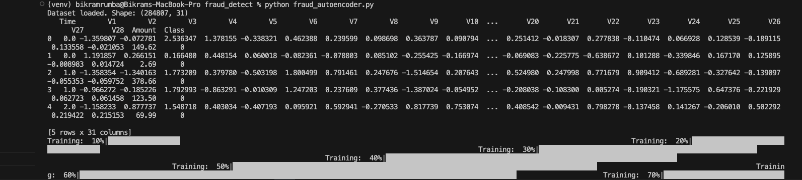
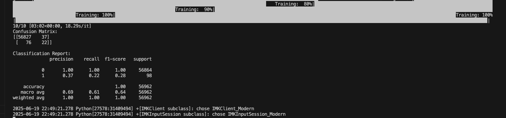
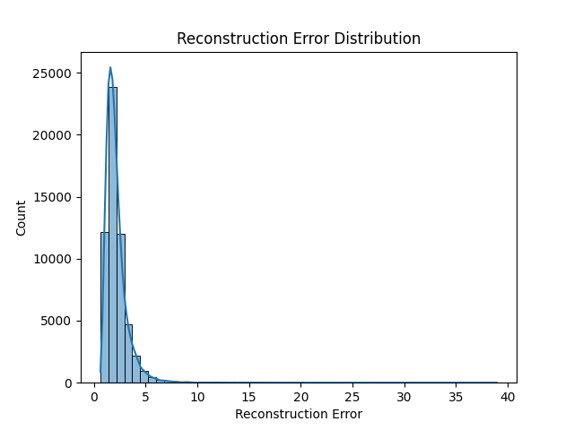

# fraud_detection
# 💳 Credit Card Fraud Detection using AutoEncoder (PyOD)

This project applies a deep learning-based anomaly detection approach using an **AutoEncoder** from the [PyOD](https://pyod.readthedocs.io/) library to identify fraudulent transactions in an anonymized credit card dataset.

AutoEncoders learn the pattern of normal transactions and identify frauds as outliers based on **reconstruction error**.

---

## 📁 Dataset

The dataset used is the **Credit Card Fraud Detection Dataset** from Kaggle.

- Download the dataset from:
  👉 [https://www.kaggle.com/datasets/mlg-ulb/creditcardfraud](https://www.kaggle.com/datasets/mlg-ulb/creditcardfraud)

- Extract the `creditcard.csv` file into the root project folder.
---

## 🔒 Handling `kaggle.json` Securely

To use the Kaggle API to download the dataset, you need a `kaggle.json` API key. However, **do not upload this file to GitHub** — it contains sensitive credentials.

### ✅ Steps to Use Securely:

1. **Download your API token** from [Kaggle → Account Settings](https://www.kaggle.com/account)
2. Save it as `kaggle.json` in your project folder or in the location below:

   - Linux/macOS: `~/.kaggle/kaggle.json`
   - Windows: `%USERPROFILE%\.kaggle\kaggle.json`

3. Add `kaggle.json` to `.gitignore` to prevent it from being committed:

```bash
   echo kaggle.json >> .gitignore
```


Alternatively, for testing:
- Download the pre-packaged zipped test file here:
  👉 `fraud_detection.zip` *(hosted in this repo or your Google Drive/GitHub if applicable)*

---

## 📦 Installation

### ✅ Requirements

 Note: This project is tested on Python 3.9. Please ensure Python 3.9 is installed before proceeding.
## 🔒 Create and activate a virtual environment:

### On Windows:
```bash
python3.9 -m venv venv
venv\Scripts\activate
```
### On macOS/Linux:
```bash
python3.9 -m venv venv
source venv/bin/activate
```
### 📦 Install dependencies:
```bash
pip install -r requirements.txt
```

Or Manually install the key packages:
```bash
pip install pandas numpy matplotlib seaborn scikit-learn pyod
```

# How to Run
1. Clone the repository
```bash
git clone https://github.com/Rumba19/fraud_detection 
cd fraud-detection-autoencoder
```

2. Place the dataset
- Ensure `creditcard.csv` is present in the project root.
- You can use either the full dataset or the one inside `fraud_detection.zip` (unzip first).

3. Run the model:
```bash
python fraud_autoencoder.py
```

4. Expected OutComes




